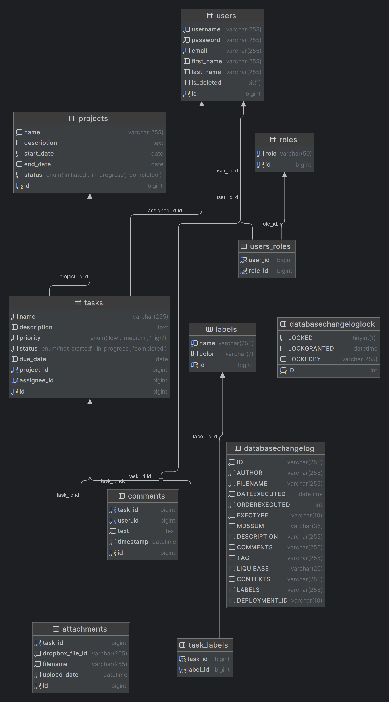

# TaskHive

## Description

**TaskHive** is a project and task management web application with file attachment support.

It allows users to create projects, add and manage tasks, comment on them, and upload attachments.

The system integrates with Dropbox for file storage and includes secure user authentication with role-based access.

This project was built for educational purposes to practice skills in Spring Boot, REST API design, security, ORM, Docker, and integration with external APIs.

---

## 🛠️ Technologies & Tools

- **Spring Boot 3.4.2** — Main framework for building the REST API.

- **Spring Security (from Spring Boot 3.4.2)** — Secures the API with authentication and authorization.

- **Spring Data JPA (from Spring Boot 3.4.2)** — Handles database interaction.

- **MySQL 8.3.0** — Main relational database.

- **Liquibase 4.24.0** — Manages database migrations.

- **Dropbox SDK 7.0.0** — For uploading and retrieving files from Dropbox.

- **JUnit 5 + MockMvc 5.1.1** — For unit and integration testing.

- **Swagger (Springdoc OpenAPI 2.8.5 + Springfox UI 3.0.0)** — API documentation and testing tool.

- **Docker + Docker Compose** — For containerization and easy environment setup.

---

## 📌 REST API Endpoints

### 🔐 Auth

- `POST /api/auth/register` — User registration

- `POST /api/auth/login` — User authentication

### 👤 Users

- `PUT /api/users/{id}/role` — Update user role (admin only)

- `GET /api/users/me` — Get current user profile info

- `PUT /api/users/me` — Update current user profile

- `PATCH /api/users/me` — Partially update current user profile

### 📁 Projects

- `POST /api/projects` — Create a new project

- `GET /api/projects` — Retrieve all user projects

- `GET /api/projects/{id}` — Retrieve project details

- `PUT /api/projects/{id}` — Update project

- `DELETE /api/projects/{id}` — Delete project

### ✅ Tasks

- `POST /api/tasks` — Create a new task

- `GET /api/tasks` — Retrieve tasks (optional filters by project, status, etc.)

- `GET /api/tasks/{id}` — Retrieve task details

- `PUT /api/tasks/{id}` — Update task

- `DELETE /api/tasks/{id}` — Delete task

### 💬 Comments

- `POST /api/comments` — Add a comment to a task

- `GET /api/comments?taskId={taskId}` — Retrieve comments for a task

### 📎 Attachments

- `POST /api/attachments` — Upload an attachment to a task (uploaded to Dropbox, ID stored in DB)

- `GET /api/attachments?taskId={taskId}` — Retrieve attachments for a task (Dropbox files via stored IDs)

### 🏷️ Labels

- `POST /api/labels` — Create a new label

- `GET /api/labels` — Retrieve all labels

- `PUT /api/labels/{id}` — Update label

- `DELETE /api/labels/{id}` — Delete label

---

## 📋 Features

- 👤 **User Registration & Authentication**

- ✅ **CRUD operations for tasks, projects, and comments**

- 📁 **Upload and download file attachments via Dropbox**

- 🔐 **Role-based access control (User / Admin)**

- 📊 **Interactive API documentation via Swagger UI**

- 🧪 **Integration tests with test containers**

---

## 🧩 Project's API

- [Swagger UI](https://taskhive-demo.me/api/swagger-ui/index.html#/)

- Postman collection available upon request

---

## 🧪 DB schema

[ER Diagram](images/img.png)

---

## 🧰 Prerequisites

- **Java 17+**

- **Docker & Docker Compose**

- **MySQL** or Dockerized MySQL instance

- IDE (e.g., IntelliJ IDEA)

---

## 🚀 How to Use

- **Clone the Repository**:

   ```bash
   https://github.com/Yam0r/Spring-Boot-intro.git

- Create the **.env** File: Create a file named **.env** in the root directory of the project and add the following variables:

   ```dotenv
  
  MYSQLDB_USER=yourname
  MYSQLDB_PASSWORD=yourpassword
  MYSQLDB_DATABASE=yourdatabase
  MYSQL_LOCAL_PORT=3307
  MYSQL_DOCKER_PORT=3306
  SPRING_LOCAL_PORT=8081
  SPRING_DOCKER_PORT=8080
  DEBUG_PORT=5005
- Run Docker Compose:

   ```bash
  docker-compose up --build

- Access the Application: Open your browser and go to http://localhost:8080.

